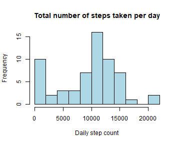
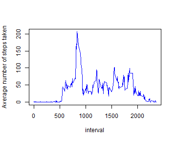
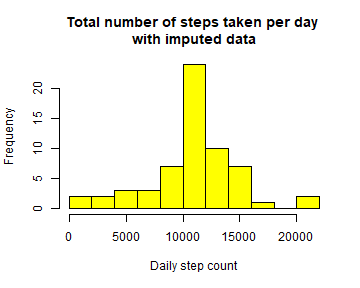
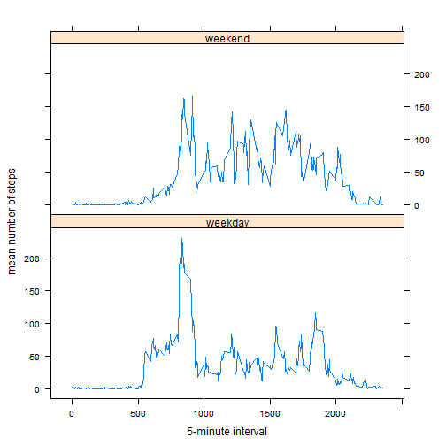

### Loading and Preprocessing Data 

#### Downloading, unzipping, and loading data into R


```r
setwd("~./DataScience/ReproducibleResearch/Assignment1")
URL <-"https://d396qusza40orc.cloudfront.net/repdata%2Fdata%2Factivity.zip"    
download.file(URL, destfile = "activitymonitoringdata.zip")
unzip("activitymonitoringdata.zip")
list.files() #view folder contents
```

```
## [1] "activity.csv"               "activitymonitoringdata.zip"
```

```r
activity <- read.csv("activity.csv",header=TRUE, stringsAsFactors = FALSE)
```

### What is the mean total number of steps taken per day?

#### 1. Calculate the total number of steps taken per day

```r
library(dplyr)
#convert dataframe to tibble
act_tbl <- tbl_df(activity)
#sum steps by day
result <- act_tbl %>%
    group_by(date) %>%
    summarize(step.sum = sum(steps, na.rm=TRUE)) 
#Show result
head(result)
```

```
## # A tibble: 6 x 2
##         date step.sum
##        <chr>    <int>
## 1 2012-10-01        0
## 2 2012-10-02      126
## 3 2012-10-03    11352
## 4 2012-10-04    12116
## 5 2012-10-05    13294
## 6 2012-10-06    15420
```

#### 2. Make a histogram of the total number of steps taken each day

```r
hist(result$step.sum,breaks=12,col="lightblue",main="Total number of steps taken per day", xlab="Daily step count")
```



#### 3. Calculate and report the mean and median of the total number of steps taken per day

```r
mean(result$step.sum, na.rm=TRUE)
```

```
## [1] 9354.23
```

```r
median(result$step.sum,na.rm=TRUE)
```

```
## [1] 10395
```

### What is the average daily activity pattern?

#### 1. Make a time series plot of the 5-minute interval and the average number of steps taken, averaged across all days


```r
#averaging steps taken by interval across all days
pat <- act_tbl %>%
    filter(!is.na(steps)) %>%
    group_by(interval) %>%
    summarize(av.steps = mean(steps))    
#plotting interval and average steps taken
with(pat, plot(interval,av.steps,type="l",xlab="interval",ylab="Average number of steps taken",col="blue"))
```



#### 2. Which 5-minute interval, on average across all the days in the dataset, contains the maximum number of steps?


```r
whichinterval<-pat[pat$av.steps==max(pat$av.steps),"interval"]
data.frame(whichinterval)[1,1] #printing result
```

```
## [1] 835
```

### Imputing missing values

#### 1. Calculate and report the total number of missing values in the dataset

```r
missingdata <- is.na(act_tbl$steps)
table(missingdata)
```

```
## missingdata
## FALSE  TRUE 
## 15264  2304
```

#### 2. Devise a strategy for filling in all of the missing values in the dataset.


```r
#Strategy: Using mean steps per interval across all days to impute
pat1 <- as.data.frame(pat) #converting previously generated summary data by interval to dataframe

#Function to extract the mean steps given an interval from a dataframe
av.value <- function(df,x){    
    row <- df[df$interval %in% x,]
    row[,2]    
    }

#Creating a new variable of mean steps per interval with original and imputed values, employing av.value function
    activity$steps_imp <- NA #initializing vector
for(i in seq_along(activity$steps)){
    if(is.na(activity$steps[i])==TRUE){
        activity$steps_imp[i] <- av.value(pat1,x=activity$interval[i])
        }
    else {
        activity$steps_imp[i] <- activity$steps[i]    
        }
}
```

#### 3. Create a new dataset that is equal to the original dataset but with the missing data filled in.

```r
activity_imp <- data.frame(activity$steps_imp,activity$date,activity$interval)
colnames(activity_imp) <- c("steps","date","interval")
head(activity_imp)
```

```
##       steps       date interval
## 1 1.7169811 2012-10-01        0
## 2 0.3396226 2012-10-01        5
## 3 0.1320755 2012-10-01       10
## 4 0.1509434 2012-10-01       15
## 5 0.0754717 2012-10-01       20
## 6 2.0943396 2012-10-01       25
```

#### 4a. Make a histogram of the total number of steps taken each day, with imputed data

```r
#converting new dataset to tibble for processing with dplyr package
act_imp_tbl <- tbl_df(activity_imp)

#Grouping data by date and calculating the sum
result_imp <- act_imp_tbl %>%
    group_by(date) %>%
    summarize(step.sum = sum(steps, na.rm=TRUE))

#Creating histogram
hist(result_imp$step.sum,breaks=12,col="yellow",main="Total number of steps taken per day \nwith imputed data", xlab="Daily step count")
```



#### 4b. Calculate and report the mean and median total number of steps taken per day

```r
mean(result_imp$step.sum, na.rm=TRUE)
```

```
## [1] 10766.19
```

```r
median(result_imp$step.sum, na.rm=TRUE)
```

```
## [1] 10766.19
```

#### 4c. Comparison and interpretation of results:  
mean (unmodified data) = 9354.23  
median (unmodified data) = 10395  
mean (imputed data) = 10766.19  
median (imputed data) = 10766.19  
  
The values of the mean and median differ when using the imputed data. Using imputed data reduces the natural spread of the data and increases the centralized tendency of the distribution. Hence the frequency of the 10000-12500 step count increases with imputed data as seen on the histograms. The mean and median are the same value indicating no skew to the distribution. 
  
### Are there differences in activity patterns between weekdays and weekends?

#### 1. Create a new factor variable in the dataset with two levels - "weekday" and "weekend" 


```r
#Using new dataset with imputed data (activity_imp)
#Converting date variable to date format
activity_imp$date <- as.Date(activity_imp$date, format="%Y-%m-%d")

#creating weekdays variable identifying day of the week
activity_imp$weekdays <- weekdays(activity_imp$date, abbreviate=TRUE)

#Assigning weekday and weekend labels to weekday variable
for(i in seq_along(activity_imp$date)){
    if(weekdays(activity_imp$date[i],abbreviate=TRUE) %in% c("Mon","Tue","Wed","Thu","Fri")){
        activity_imp$weekdays[i] <- "weekday"   
    }
    else {
        activity_imp$weekdays[i] <- "weekend" 
    }
}
```

#### 2. Make a panel plot

```r
#Convert dataset with imputed data to tibble (for dplyr package use)
act_imp_tbl1 <- tbl_df(activity_imp)

#With new dataset, calculated mean steps taken by weekday/weekend and by interval
pat_imp <- act_imp_tbl1 %>%
    group_by(weekdays, interval) %>%
    #group_by(interval) %>%
    summarize(av.steps = mean(steps))    

#Create panel plot with lattice
library(lattice)
xyplot(av.steps~interval|weekdays,pat_imp,layout=c(1,2),type="l",xlab="5-minute interval",ylab="mean number of steps")
```




